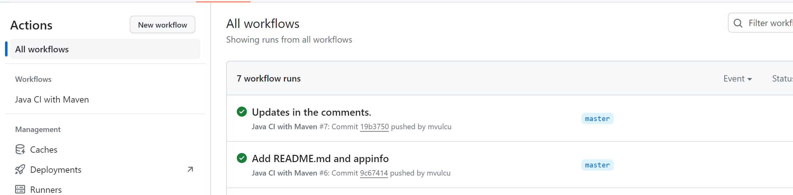
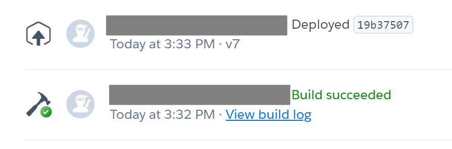

# WeatherApp

## Accessing the Application
The WeatherApp is deployed and accessible online. You can interact with the live application by visiting the following URL:
[WeatherApp Live](https://sleepy-shelf-48977-40fe135f3481.herokuapp.com/weather)

## Overview
WeatherApp is a Spring Boot application designed to provide weather information via a REST API. Utilizing the best practices of Test-Driven Development (TDD), containerization with Docker, UML modeling, API integration, and Continuous Integration and Deployment (CI/CD) with GitHub Actions and Heroku, this project demonstrates a systematic approach to software development.

## Features
- REST API endpoints to retrieve weather data for cities.
- Dockerfile and docker-compose for containerization.
- UML diagrams and BDD specifications.
- CI/CD with GitHub Actions for automated testing and Heroku for deployment.

## Technical Stack
- Spring Boot
- Docker for containerization
- JUnit and Mockito for testing
- Maven for dependency management and project lifecycle.
- GitHub Actions for CI/CD
- Heroku for deployment

## Project Structure

### API Endpoints
- `GET: /api/country/cities` - List all cities in a country.
- `GET: /api/weather/city` - Show the weather for the specified city, including temperature.

### Directory Structure
- `.github/workflows` - Contains GitHub Actions CI/CD configuration.
- `src/main/java` - Source code for the application.
    - `com.example.weatherapp` - Main package.
        - `dto` - Data Transfer Objects package with `WeatherResponse.java`.
        - `AppConfig.java` - Application configuration class.
        - `WeatherappApplication.java` - Main class for the Spring Boot application.
        - `WeatherController.java` - HTTP request handler.
        - `WeatherService.java` - Business logic and external weather service interaction.
- `src/main/resources`
    - `static` and `templates` - Front-end resources and templates.
    - `application.properties` - Application configuration properties.
- `src/test/java` - Application tests.
    - `WeatherappApplicationTests.java` - Main class tests.
    - `WeatherServiceTest.java` - Weather service tests.
- `target` - Contains compiled project files.
- Docker configuration files: `Dockerfile` and `docker-compose.yml`.
- Heroku configuration: `heroku.yml`.
- Maven wrappers: `mvnw` and `mvnw.cmd`.
- Maven configuration: `pom.xml`.
- Project documentation: `README.md`.

## Running the Application
1. Build the application using Maven: `mvn clean install`.
2. To create a Docker container for the application, run: `docker build -t weatherapp .`.
3. Start the application using: `docker-compose up`.

## Testing
- Execute the automated tests using `mvn test`.
- WeatherappApplicationTests checks the Spring Boot context loading.
- WeatherServiceTest includes unit tests with mocked external API responses.

## CI/CD Pipeline
GitHub Actions is configured for Continuous Integration, running tests on every push to the master branch or pull request. The successful build is then deployed to Heroku using Docker containers.

## Learning Outcomes
- Developing a Spring Boot application exposing RESTful services.
- Writing unit tests and integration tests using JUnit and Mockito.
- Containerizing an application with Docker.
- Applying TDD for a robust and regression-proof codebase.
- Continuous Integration and Continuous Deployment using GitHub Actions and Heroku.
- Experience with Maven project management and using Java 17.

## Additional Documentation
- UML Diagrams are included within the `docs` directory.
- BDD specifications can be found in the `specifications` folder.

For more detailed instructions on setup, testing, and deployment, please refer to the corresponding directories and code documentation.
